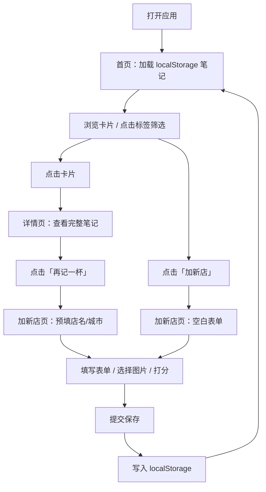

## 1. 产品概述

「杯测日记」是一款轻量级的个人咖啡店探店笔记应用，帮助咖啡爱好者在品尝完咖啡后快速记录店内体验，并方便后续回顾与查找。应用支持单人使用，也可轻松分享给朋友。

- **主要目的**：快速记录咖啡探店信息（店名、城市、豆种、星级、感受、图片），并以可视化卡片形式回顾
- **目标用户**：咖啡爱好者、探店达人、喜欢记录生活点滴的个人用户
- **产品价值**：用极简的操作流程和温暖的纸感设计，打造专属的咖啡记忆收藏夹

---

## 2. 核心功能

### 2.1 用户角色

| 角色 | 注册方式 | 核心权限 |
|------|----------|----------|
| 普通用户 | 无需注册，本地使用 | 创建、查看、筛选所有探店笔记 |

### 2.2 功能模块

1. **首页（卡片流）**：按时间倒序展示所有探店卡片，顶部标签筛选条
2. **详情页**：单条笔记的完整内容展示，「再记一杯」快捷追加功能
3. **加新店页**：表单录入新探店记录，含星级打分、图片预览

### 2.3 页面详情

| 页面名称 | 模块名称 | 功能描述 |
|----------|----------|----------|
| 首页 | 导航栏 | 应用标题「杯测日记」，右侧「加新店」入口按钮 |
| 首页 | 标签筛选条 | 横向排列豆种标签（全部/手冲/意式/冷萃/其他），点击切换筛选 |
| 首页 | 卡片瀑布流 | 网格布局，时间倒序展示，每张卡片含店名、城市、星级、标签、缩略图 |
| 详情页 | 笔记详情 | 大图、完整店名城市、豆种标签、星级、时间、完整感受文字 |
| 详情页 | 操作区 | 返回按钮 + 「再记一杯」按钮（跳转表单页并预填店名/城市） |
| 加新店页 | 表单 | 店名输入、城市输入、豆种单选组、5星打分、多行感受文本框、图片选择预览 |
| 加新店页 | 提交 | 保存按钮将数据写入 localStorage，成功后跳转首页 |

---

## 3. 核心流程

### 3.1 主流程描述

用户打开应用 → 首页展示所有历史笔记卡片 → 可通过顶部标签快速筛选 → 点击单张卡片进入详情页查看完整内容 → 详情页点击「再记一杯」可快速追加同店新记录 → 或从首页点击「加新店」进入空白表单 → 填写并提交后数据持久化到 localStorage，刷新不丢失。

### 3.2 流程图

---

## 4. 用户界面设计

### 4.1 设计风格

- **主色调**：深棕 `#6F4E37`，用于按钮、标签选中态、重要文字
- **背景色**：奶白 `#F5EFE6`，纸感底色，全局背景
- **文字色**：墨色 `#2C1810`，正文文字，温暖不刺眼
- **按钮样式**：圆角 12px，深棕填充 + 奶白文字，hover 轻微加深 + 阴影上浮
- **卡片样式**：圆角 16px，柔和投影 `0 4px 20px rgba(111,78,55,0.10)`，白底微透
- **字体**：
  - 标题：思源宋体（Source Han Serif SC / Noto Serif SC）
  - 正文：系统无衬线（-apple-system, Segoe UI, PingFang SC 等）
- **图标风格**：线性简洁风（lucide-react）
- **纸感细节**：轻微纸张纹理背景（CSS 噪点或线性渐变模拟），卡片有极细的深棕描边 `rgba(111,78,55,0.08)`

### 4.2 页面设计概览

| 页面名称 | 模块名称 | UI 元素 |
|----------|----------|---------|
| 首页 | 导航栏 | 左：「杯测日记」大号思源宋体标题；右：深棕圆角「加新店」按钮带加号图标 |
| 首页 | 标签筛选条 | 横向滚动容器，标签 pill 形状，默认态白底深棕字细边框，选中态深棕底奶白字，过渡动画 |
| 首页 | 卡片网格 | 响应式 2~3 列网格，间距 24px，卡片 hover 阴影加深 + 轻微上浮 |
| 详情页 | 顶部操作 | 左上返回箭头按钮，右上「再记一杯」深棕主按钮带咖啡杯图标 |
| 详情页 | 内容区 | 大图居中圆角展示，店名超大号思源宋体，城市小一号，豆种标签，星级，时间，感受正文段落 |
| 加新店页 | 表单区 | 纵向排列，输入框圆角浅棕边框，聚焦时深棕边框；豆种单选按钮组；星级可点击；图片选择框带虚线边框占位；底部提交按钮 |

### 4.3 响应式设计

- **桌面优先**（≥1024px）：三列卡片网格，详情页宽度最大 800px 居中
- **平板**（768px~1023px）：两列卡片网格
- **移动端**（<768px）：单列卡片网格，标签筛选条横向滚动，表单全屏宽度

---
