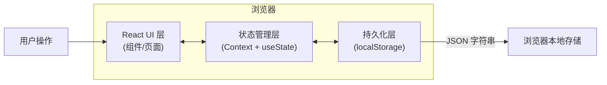
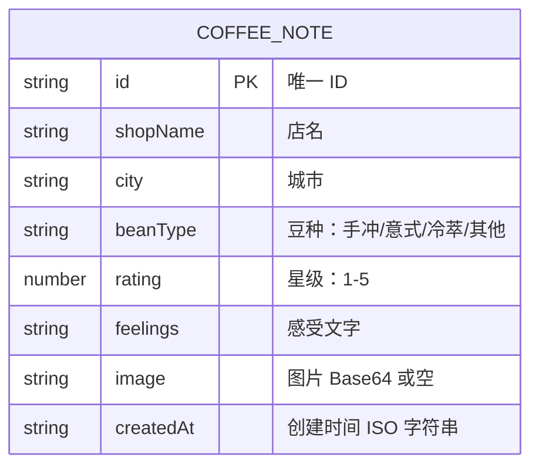

## 1. 架构设计

纯前端单页应用，数据存储在浏览器 localStorage，无后端依赖。



---

## 2. 技术选型说明

| 领域 | 技术选择 | 说明 |
|------|----------|------|
| 前端框架 | React 18 + TypeScript | 组件化开发，类型安全 |
| 构建工具 | Vite 5 | 快速冷启动与 HMR |
| 路由 | react-router-dom v6 | 三个页面间跳转，唯一依赖的外部大库 |
| 样式 | Tailwind CSS 3 | 原子化 CSS，自定义设计令牌 |
| 状态管理 | React Context + useState | 符合用户要求，不引入额外大库 |
| 持久化 | localStorage | 纯前端存储，刷新不丢数据 |
| 图标 | lucide-react | 线性简洁图标库 |

---

## 3. 路由定义

| 路由路径 | 页面组件 | 用途 |
|----------|----------|------|
| `/` | `HomePage` | 首页：卡片流 + 标签筛选 |
| `/note/:id` | `DetailPage` | 详情页：单条笔记完整展示 |
| `/add` | `AddPage` | 加新店页：空白表单录入 |
| `/add?shopId=xxx` | `AddPage` | 再记一杯：预填店名/城市 |

---

## 4. 数据模型

### 4.1 ER 图



### 4.2 TypeScript 类型定义

```typescript
export type BeanType = '手冲' | '意式' | '冷萃' | '其他';

export interface CoffeeNote {
  id: string;
  shopName: string;
  city: string;
  beanType: BeanType;
  rating: number; // 1 ~ 5
  feelings: string;
  image?: string; // base64 data URL
  createdAt: string; // ISO date string
}
```

### 4.3 localStorage 存储约定

- **Key**：`cup-diary-notes`
- **Value**：`CoffeeNote[]` 的 JSON 字符串
- **初始化**：首次加载若无数据，注入 3 条示例笔记用于演示

---

## 5. 目录结构

```
src/
├── types/
│   └── index.ts              # 全局类型定义
├── context/
│   └── CoffeeNoteContext.tsx # Context Provider + CRUD
├── components/
│   ├── Layout.tsx            # 全局布局（带导航）
│   ├── CoffeeCard.tsx        # 首页卡片组件
│   ├── StarRating.tsx        # 星级展示/打分组件
│   ├── TagChip.tsx           # 标签 pill 组件
│   ├── TagFilterBar.tsx      # 顶部标签筛选条
│   └── ImageUploader.tsx     # 图片选择与预览组件
├── pages/
│   ├── HomePage.tsx          # 首页
│   ├── DetailPage.tsx        # 详情页
│   └── AddPage.tsx           # 加新店页
├── utils/
│   └── storage.ts            # localStorage 读写工具
├── App.tsx                   # 路由入口
├── main.tsx                  # 应用挂载
└── index.css                 # 全局样式 + Tailwind 指令
```

---

## 6. 核心模块职责

### 6.1 CoffeeNoteContext

- 从 localStorage 加载数据并初始化 state
- 提供：`notes`、`addNote()`、`getNoteById()`、`getShopInfoById()`
- 任何变更自动同步写回 localStorage

### 6.2 页面职责

- **HomePage**：消费 Context，处理当前选中标签筛选逻辑，渲染筛选条 + 卡片网格
- **DetailPage**：通过 URL `:id` 获取单条笔记，渲染详情，「再记一杯」携带 shopId 跳转
- **AddPage**：管理表单本地 state，提交时调用 Context `addNote()`，支持从 URL query 预填

### 6.3 组件职责

- 纯展示 / 受控组件，不直接依赖 Context，数据通过 props 传入
- 单一职责，文件体积控制在 200 行以内

---
